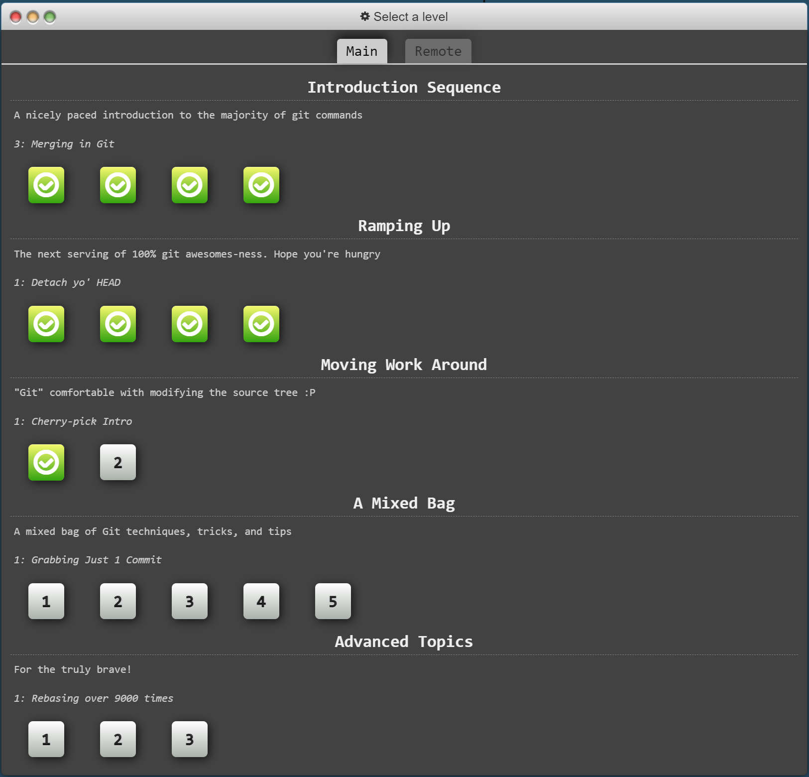
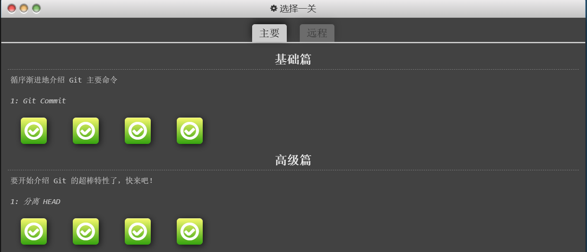

# 实验一 Git和Markdown基础

班级： 21计科02

学号： B20210302232

姓名： 闫新宇

Github地址：<https://github.com/yanxinyvvv/xysyy.git>

---

## 实验目的

1. Git基础，使用Git进行版本控制
2. Markdown基础，使用Markdown进行文档编辑

## 实验环境

1. Git
2. VSCode
3. VSCode插件

## 实验内容和步骤

### 第一部分 实验环境的安装

1. 安装git，从git官网下载后直接点击可以安装：[git官网地址](https://git-scm.com/)
2. 从Github克隆课程的仓库：[课程的仓库地址](https://github.com/zhoujing204/python_course)，运行git bash应用（该应用包含在git安装包内），在命令行输入下面的命令（命令运行成功后，课程仓库会默认存放在Windows的用户文件夹下）

```bash
git clone https://github.com/zhoujing204/python_course.git
```

如果你在使用`git clone`命令时遇到SSL错误，请运行下面的git命令(这里假设你的Git使用了默认安装目录)：

```bash
git config --global http.sslCAInfo C:/Program Files/Git/mingw64/ssl/certs/ca-bundle.crt
```

该仓库的课程材料后续会有更新，如果需要更新课程材料，可以在本地课程仓库的目录下运行下面的命令：

```bash
git pull
```

3. 注册Github账号，创建一个新的仓库，用于存放实验报告和实验代码。
4. 安装VScode，下载地址：[Visual Studio Code](https://code.visualstudio.com/)
5. 安装下列VScode插件
   - GitLens
   - Git Graph
   - Git History
   - Markdown All in One
   - Markdown Preview Enhanced
   - Markdown PDF
   - Auto-Open Markdown Preview
   - Paste Image
   - markdownlint

### 第二部分 Git基础

教材《Python编程从入门到实践》P436附录D：使用Git进行版本控制，按照教材的步骤，完成Git基础的学习。

### 第三部分 learngitbranching.js.org

访问[learngitbranching.js.org](https://learngitbranching.js.org)，如下图所示完成Main部分的Introduction Sequence和Ramping Up两个小节的学习。


​​https://img-blog.csdnimg.cn/590b625149ef47eab6a2b7751e61b0c1.png

上面你学习到的git命令基本上可以应付百分之九十以上的日常使用，如果你想继续深入学习git，可以：

- 继续学习[learngitbranching.js.org](https://learngitbranching.js.org)后面的几个小节（包括Main和Remote）
- 在日常的开发中使用git来管理你的代码和文档，用得越多，记得越牢
- 在git使用过程中，如果遇到任何问题，例如：错误删除了某个分支、从错误的分支拉取了内容等等，请查询[git-flight-rules](https://github.com/k88hudson/git-flight-rules)

### 第四部分 Markdown基础

查看[Markdown cheat-sheet](http://www.markdownguide.org/cheat-sheet)，学习Markdown的基础语法

使用Markdown编辑器（例如VScode）编写本次实验的实验报告，包括[实验过程与结果](#实验过程与结果)、[实验考查](#实验考查)和[实验总结](#实验总结)，并将其导出为 **PDF格式** 来提交。

## 实验过程与结果
### Git基础
* 1、安装Git
* 2、配置Git：Git会跟踪是谁修改了项目，哪怕参加项目开发的人只有一个。为此，Git需要知道你的用户名和电子邮件地址。必须提供用户名，但可使用虚构的电子邮箱地址：
```bash
$ git config --global user.name "username"
$ git config --global user.email "username@example.com"
```
最好设置每个项目中分支的默认名称，一个不错的主分支名称是main：
```bash
$ git config --global init.defaultBranch main
```
* 3、创建项目：在系统中创建一个文件夹，并将其命名为git_practice。在这个文件夹中，创建一个简单的Python程序，将使用这个程序来探索Git的基本功能：
```python
print("Hello Git world!")
```
* 4、忽略文件：扩展名为.pyc的文件是根据.py文件自动生成的，因此无须让Git跟踪它们。这些文件存储在目录_pycache_中。为了让Git忽略这个目录，创建一个名为.gitignore的特殊文件，并在其中添加如下一行内容：
```
_pycache_/
```
* 5、初始化仓库：打开一个终端窗口，切换到文件夹git_practice，并执行如下命令：
```bash
git_practices$ git init
Initialized empty Git repository in git_practice./git/
git_practice$
```
输出表明Git在git_practice中初始化了一个空仓库。
* 6、检查状态：执行其他操作前，看一下项目的状态，执行如下命令：
```bash
git_practice$ git status
On branch main
No commits yet

Untrackedfiles:
  (use "git add <file>..." to include in what will be committed)
      .gitignore
      hello_git.py

nothing added to commit but untracked files present (use "git add" to track)
git_practice$
```
从这里的输出可知，我们位于分支main上。每当查看项目的状态上，输出都将指出位于分支main上。接下来的输出表明，还未执行任何提交。Git指出了项目中未被跟踪的文件，因为还没有告诉它要跟踪哪些文件。接下来，Git告诉我们没有将任何东西添加到当前的提交中，并且指出了可能需要加入仓库的未跟踪文件。
* 7、将文件加入仓库：下面将这两个文件加入仓库，并再次检查状态，执行如下命令：
```bash
git_practice$ git add.
git_practice$ git status
On branch main
No commits yet

Changes to be committed:
  (use "git rm --cached<file>..." to instage)
      new file:   .gitignore
      new file:   hello_git.py

git_practice$
```
命令git add.将项目中未被跟踪的所有文件都加入仓库。它不提交这些文件，只是让Git关注它们。现在检查项目的状态，会出现Git找出了一些需要提交的修改。new file意味着这些文件是新添加到仓库中的。
* 8、执行提交：下面来执行提交,执行如下命令：
```bash
git_practices$ git commit -m "Started project."
[main (root-commit) cea13dd] Started project.
2 files changed, 5 insertions(+)
 create mode 100644 .gitignore
 create mode 100644 hello_git.py
git_practice$ git status
On branch main
nothing to commit, working tree clean
git_practice$
```
我们执行命令git commit -m "message"创建项目的快照。标志-m让Git将接下来的消息记录到项目的历史记录中。输出表明我们位于分支main上且有两个文件被修改了。
* 9、查看提交历史：
Git记录所有的项目提交。下面来看以下提交历史：
```bash
git_practices$ git log
commit cea13ddc51b885d05a410201a54faf20e0d2e246 (HEAD -> main)
Author: yanxinyvvv <1653828314@qq.com>
Date:   Mon Sep 25 14:23:34 2023 -0800

    Started project.
git_practice$
```
每次提交时，Git都会生成一个独一无二的引用ID，长度未40个字符。它记录提交是谁执行的，提交的时间，以及提交时指定的消息。并非在任何情况下都需要所有这些信息，因此Git提供了一个选项，让你能够打印提交历史条目的简单版本：
```bash
git_practices$ git log --pretty=oneline
cea13ddc51b885d05a410201a54faf20e0d2e246 (HEAD -> main) Started project.
git_practice$
```
标志--pretty=oneline指定显示两项最重要的信息：提交的引用ID，以及为提交记录的信息。
###  learngitbranching.js.org学习
#### 基础篇
##### 1、git commit
```bash
git commit
```
##### 2、git branch
```bash
git branch bugFix
git checkout bugFix
git checkout -b bugFix
```
##### 3、git merge
```bash
git checkout -b bugFix
git commit
git checkout main
git commit
git merge bugFix
```
##### 4、git rebase
```bash
git checkout -b bugFix
git commit
git checkout main
git commit
git checkout bugFix
git rebase main
```
#### 高级篇
##### 5、分离 HEAD
```bash
git checkout C4
```
##### 6、相对引用（^）
```bash
git checkout bugFix
git checkout C4
git checkout HEAD^
git checkout C4^
git checkout C4~1
```
##### 7、相对引用（~）
```bash
git branch -f main C6
git checkout HEAD^
git branch -f bugFix HEAD~1
```
##### 8、撤销变更
```bash
git reset HEAD^
git checkout pushed
git revert HEAD
```
##### 学习结果

https://img-blog.csdnimg.cn/3bf834adb9ab4edc95fb350235e63bfd.png

### Markdown基础
Markdown 是一种轻量级标记语言，它允许使用易于阅读、易于编写的纯文本格式来编写文档。Markdown 被广泛用于编写文档、笔记、博客文章等,以下是一些常用的 Markdown 语法：

(1)标题：使用井号（#）表示标题，一个井号表示一级标题，两个井号表示二级标题，以此类推。例如：
```
# 一级标题  
## 二级标题  
### 三级标题
```
(2)列表：使用星号（*）或加号（+）或减号（-）表示列表项。例如：
```
- 列表项1  
- 列表项2  
- 列表项3  
  
1. 列表项1  
2. 列表项2  
3. 列表项3
```
(3)引用：使用大于号（>）表示引用。例如：
```
> 这是一句引用。
```
(4)代码块：使用三个反引号（```）表示代码块。例如：
```python  
def hello():  
    print("Hello, world!")
```
(5)链接：使用方括号（[]）和圆括号（()）表示链接。例如：
```
[链接文本](http://github.com/yanxinyvvv)
```
(6)图片：使用感叹号（!）和方括号和圆括号表示图片。例如：
```

```
(7)表格：使用竖线（|）和横线（-）表示表格。例如：
```
| 表头1 | 表头2 | 表头3 |  
| :--: | :--: | :--: |  
| 单元格1 | 单元格2 | 单元格3 |  
| 单元格4 | 单元格5 | 单元格6 |
```
## 实验考查
1. 什么是版本控制？使用Git作为版本控制软件有什么优点？
(1)版本控制软件使我们能够为处于可行状态的项目创建快照。修改项目(如实现新功能)后，如果项目不能正常运行，可恢复到上一个可行状态。它是一种跟踪和管理文件、代码、文档等对象变更的历史记录的系统。它可以帮助开发者追踪和记录每个改动，包括改动的详细时间和内容，这样就可以方便地回溯到任何一个版本的状态，或者比较两个版本之间的差异。版本控制对于团队协作开发尤其重要，因为它可以帮助团队成员同步和共享代码，避免代码冲突。(2)Git有能力高效管理类似Linux内核一样的超大规模项目;Git实现了离线开发、代码审核特性，解决了跨地域协同开发中代码质量和编码协同的问题;分支管理功能强大，便于查询和追溯分支间的提交历史;Git基于DAG(有向非环图)的设计比SVN的线性提交提供更好的合并追踪，避免不必要的冲突，提高工作效率;Git通过哈希加密保证数据的完整性，防止恶意篡改;代码分布存储，异地容灾，保证数据安全;Git支持团队成员自建本地版本库和分支，只有客户发出合并请求，开发人员才能提交代码，客户可以对提交说明、代码规范等方面逐一审核。

2. 如何使用Git撤销还没有Commit的修改？如何使用Git检出（Checkout）已经以前的Commit用Git检出（Checkout）已经以前的Commit？（实际操作）
(1)如果保留已经修改的文件，但是撤销已经做出的修改，可以使用git restore --staged <file>，这可以将文件恢复到最近一次commit的状态，但保留本地做的修改;如果完全撤销对文件的修改,包括本地做的修改,可以使用git restore <file>,这可以将文件恢复到最近一次commit的状态，并且完全撤销对这个文件的所有修改(2)用Git检出（Checkout）以前的Commit,可以使用git checkout命令，后面跟上想检出的commit的哈希值或者分支名,这可以让工作目录切换到那个特定的commit。

3. Git中的HEAD是什么？如何让HEAD处于detached HEAD状态？（实际操作）
(1)Git中HEAD是一个指向当前检出的分支的引用,当执行git clone命令克隆一个仓库时，Git会创建一个名为HEAD的文件，其中包含指向仓库中活动分支的引用(2)首先，确定要检出的提交的哈希值或引用,可以使用git log命令查看提交历史并记录目标提交的哈希值;其次使用git checkout命令检出目标提交，这会将HEAD指针设置为指向给定的提交，并将它置于detached HEAD状态。

4. 什么是分支（Branch）？如何创建分支？如何切换分支？（实际操作）
(1)在Git中，分支是一个非常重要的概念，分支允许你在一个版本控制系统中维护多个开发线，以实现并行开发。分支是树的一个部分，可以用来分离和保护不同版本的开发，来实现新功能开发、版本隔离、维护稳定性等。分支是Git版本控制的核心，它允许开发人员在不同分支上独立工作，而不会影响其他分支或主分支的稳定性(2)使用git branch命令创建一个分支(3)使用git checkout命令后跟着想切换到的分支名称

5. 如何合并分支？git merge和git rebase的区别在哪里？（实际操作）
(1)可以使用git merge或git rebase来合并分支,这两者的区别主要在于它们的工作方式和结果(2)git merge是将两个分支的修改合并在一起，默认操作的情况下会提交合并中修改的内容，也就是说，它是在当前分支上创建新的提交，同时包含来自其他分支的新内容。相比之下，git rebase则是将当前分支的提交应用到目标分支上，创建新的提交，并删除原始分支上的已提取的提交；git merge历史提交记录中，每个分支的修改都是独立的，看起来会更清楚：仿佛所有修改都是在一根线上先后完成的。而git rebase则会把在当前分支上的所有提交放到目标分支的最新提交后面，形成一种“变基”，所以看起来就像所有修改都是在目标分支上先后完成的。

6. 如何在Markdown格式的文本中使用标题、数字列表、无序列表和超链接？（实际操作）
(1)标题：在Markdown中，标题可以通过在文本前添加井号(#)来创建。一个井号表示一级标题，两个井号表示二级标题，以此类推(2)数字列表：数字列表可以通过在每个列表项前添加数字和一个点来创建。数字通常不需要按顺序排列，Markdown会自动按顺序编号(3)无序列表：无序列表可以通过在每个列表项前添加一个短横线和一个空格来创建(4)超链接：超链接可以通过使用方括号和圆括号来创建。方括号内的文本是链接的显示文本，圆括号内的文本是链接的实际地址。

## 实验总结
通过这次实验我学习到了如何使用Git来对当前开发的程序进行版本控制。作为当前最流行的版本控制软件，它包含很多高级工具，也可帮助团队协作开发大型项目。同时，也学习到了许多常见的Git命令，以及Git与版本控制的关系，Git在团队协作中的重要性。学会了创建、切换和使用分支，创建、删除和查看标签，学会了如何处理Git冲突，如何查看Git仓库的提交历史和日志，以及使用git reset和git revert命令来重置提交或撤消某个提交。也学习到了Markdown是一种轻量级标记语言，以及包括标题、列表、空格、数字、引用、分割线、强调、链接、图片几个基础用法。在实验中，通过向老师和同学请教，学习到了很多知识，解决了很多问题。